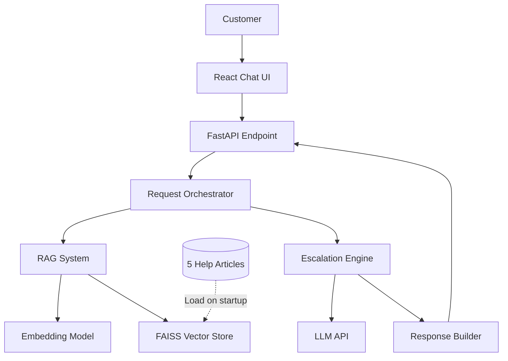

# Design Document: Smart Escalation API

## Overview

The Smart Escalation API is a lightweight RAG-based customer support system designed for 2-3.5 hour implementation. The system answers customer questions about TaskFlow using retrieval-augmented generation over 5 help articles, with intelligent escalation to human agents when confidence is low.

### Core Design Principles

1. **Simplicity First**: In-memory vector store, single API endpoint, minimal dependencies
2. **Escalation Over Uncertainty**: Conservative approach prioritizes accuracy over coverage
3. **Clear Separation**: Distinct modules for retrieval, generation, and escalation logic
4. **Free Hosting Compatible**: No external databases, deployable to Render/Railway/Vercel

### Key Components

- **FastAPI Backend**: Single POST endpoint handling question processing
- **RAG System**: In-memory FAISS vector store with sentence-transformers embeddings
- **Escalation Engine**: Rule-based decision logic using relevance scores and LLM confidence signals
- **React Chat UI**: Minimal interface for customer interaction

## Architecture

### System Architecture



### Request Flow

1. **Question Submission**: Customer submits question via Chat UI
2. **Embedding Generation**: Question is embedded using sentence-transformers
3. **Retrieval**: Top-k chunks retrieved from FAISS vector store
4. **Escalation Decision**: Engine evaluates relevance scores and context quality
5. **Response Generation**: 
   - If confident: LLM generates grounded answer
   - If uncertain: Return escalation message
6. **Response Delivery**: JSON response with answer/escalation + confidence explanation

### Technology Stack

| Component | Technology | Rationale |
|-----------|-----------|-----------|
| Backend Framework | FastAPI | Fast, async, automatic OpenAPI docs |
| Embeddings | sentence-transformers (all-MiniLM-L6-v2) | Lightweight, no API costs, good quality |
| Vector Store | FAISS (in-memory) | Fast similarity search, no external DB |
| LLM | Google Gemini API | Free tier available, high-quality generation |
| Frontend | React + Vite | Fast setup, minimal boilerplate |
| Deployment | Render/Railway | Free tier, easy Python deployment |

## Components and Interfaces

### 1. FastAPI Application (`main.py`)

**Responsibilities**:
- Expose POST `/ask` endpoint
- Handle CORS configuration
- Coordinate request processing
- Return structured JSON responses

**Interface**:
```python
@app.post("/ask")
async def ask_question(request: QuestionRequest) -> QuestionResponse:
    """
    Process customer question and return answer or escalation.
    
    Args:
        request: QuestionRequest with 'question' field
        
    Returns:
        QuestionResponse with response_type, message, confidence_explanation
    """
```

**Models**:
```python
class QuestionRequest(BaseModel):
    question: str

class QuestionResponse(BaseModel):
    response_type: Literal["answer", "escalation"]
    message: str
    confidence_explanation: str
    sources: Optional[List[str]] = None
```

### 2. RAG System (`rag.py`)

**Responsibilities**:
- Load and chunk help articles on startup
- Generate embeddings for chunks and questions
- Perform similarity search
- Return top-k relevant chunks with scores

**Interface**:
```python
class RAGSystem:
    def __init__(self, articles_dir: str, chunk_size: int = 500, chunk_overlap: int = 50):
        """Initialize RAG system with help articles."""
        
    def retrieve(self, question: str, top_k: int = 3) -> List[RetrievedChunk]:
        """
        Retrieve most relevant chunks for question.
        
        Args:
            question: Customer question
            top_k: Number of chunks to retrieve
            
        Returns:
            List of RetrievedChunk with content, score, source
        """

class RetrievedChunk:
    content: str
    score: float  # Cosine similarity score
    source: str   # Help article filename
```

**Chunking Strategy**:
- Fixed-size chunks with overlap (500 chars, 50 char overlap)
- Preserves sentence boundaries where possible
- Metadata tracks source article for each chunk

### 3. Escalation Engine (`escalation.py`)

**Responsibilities**:
- Evaluate retrieval quality (relevance scores)
- Decide whether to answer or escalate
- Generate confidence explanations
- Coordinate LLM calls when answering

**Interface**:
```python
class EscalationEngine:
    def __init__(self, llm_client: LLMClient, relevance_threshold: float = 0.5):
        """Initialize escalation engine with LLM client and thresholds."""
        
    def process_question(
        self, 
        question: str, 
        retrieved_chunks: List[RetrievedChunk]
    ) -> EscalationDecision:
        """
        Decide whether to answer or escalate.
        
        Args:
            question: Customer question
            retrieved_chunks: Retrieved context from RAG
            
        Returns:
            EscalationDecision with action, message, explanation
        """

class EscalationDecision:
    action: Literal["answer", "escalate"]
    message: str
    confidence_explanation: str
    sources: Optional[List[str]] = None
```

**Decision Logic**:
```python
def should_escalate(chunks: List[RetrievedChunk]) -> bool:
    """
    Escalate if:
    1. Best chunk score < 0.5 (low relevance)
    2. All chunks from same article (narrow coverage)
    3. LLM returns uncertainty signal in response
    """
```

### 4. LLM Client (`llm_client.py`)

**Responsibilities**:
- Abstract LLM API calls (Google Gemini)
- Format prompts with retrieved context
- Parse LLM responses
- Handle API errors gracefully

**Interface**:
```python
class LLMClient:
    def generate_answer(
        self, 
        question: str, 
        context_chunks: List[str]
    ) -> LLMResponse:
        """
        Generate answer using LLM with retrieved context.
        
        Args:
            question: Customer question
            context_chunks: Retrieved help article chunks
            
        Returns:
            LLMResponse with answer text and confidence signal
        """

class LLMResponse:
    answer: str
    uncertain: bool  # True if LLM signals uncertainty
```

**Prompt Template**:
```
You are a friendly customer support agent for TaskFlow, a project management SaaS.

Answer the customer's question using ONLY the information provided in the help articles below.

IMPORTANT RULES:
- Use a friendly, helpful tone
- Ground your answer in the provided context
- If the context doesn't contain enough information to answer confidently, respond with: "I'm not certain about this. Let me connect you with a human agent."
- Do not make up or infer information not present in the context

HELP ARTICLE CONTEXT:
{context_chunks}

CUSTOMER QUESTION:
{question}

YOUR ANSWER:
```

### 5. React Chat UI (`frontend/`)

**Responsibilities**:
- Render chat interface
- Submit questions to API
- Display answers and escalations
- Show confidence explanations

**Key Components**:
```typescript
interface Message {
  role: 'user' | 'assistant';
  content: string;
  confidenceExplanation?: string;
  responseType?: 'answer' | 'escalation';
}

function ChatInterface() {
  const [messages, setMessages] = useState<Message[]>([]);
  const [input, setInput] = useState('');
  const [loading, setLoading] = useState(false);
  
  const handleSubmit = async () => {
    // POST to /ask endpoint
    // Update messages with response
  };
}
```

## Data Models

### Help Article Structure

```python
class HelpArticle:
    """Represents a single help article."""
    filename: str
    title: str
    content: str
    chunks: List[str]  # Generated during preprocessing
```

**Article Files** (stored as markdown in `data/articles/`):
1. `getting-started.md` - TaskFlow basics, account setup, first project
2. `billing.md` - Subscription plans, payment methods, billing cycles
3. `integrations.md` - Slack, GitHub, Jira integrations
4. `permissions.md` - Team roles, access control, admin settings
5. `troubleshooting.md` - Common errors, login issues, performance tips

### Vector Store Schema

```python
# FAISS index stores:
# - embeddings: np.ndarray of shape (n_chunks, embedding_dim)
# - metadata: List[ChunkMetadata]

class ChunkMetadata:
    chunk_id: int
    source_article: str
    chunk_text: str
    start_char: int  # Position in original article
```

### API Request/Response Models

**Request**:
```json
{
  "question": "How do I add a team member to my project?"
}
```

**Response (Answer)**:
```json
{
  "response_type": "answer",
  "message": "To add a team member to your project in TaskFlow, go to Project Settings > Team Members and click 'Invite Member'. You can set their role as Viewer, Editor, or Admin depending on the permissions you want to grant.",
  "confidence_explanation": "High confidence - retrieved relevant content from 'Managing Team Permissions' article with similarity score 0.82",
  "sources": ["permissions.md"]
}
```

**Response (Escalation)**:
```json
{
  "response_type": "escalation",
  "message": "I'm not certain I can answer this accurately. Let me connect you with a human support agent who can help.",
  "confidence_explanation": "Low confidence - best retrieval score was 0.42, indicating question may be outside help article scope",
  "sources": null
}
```

## Correctness Properties

*A property is a characteristic or behavior that should hold true across all valid executions of a system—essentially, a formal statement about what the system should do. Properties serve as the bridge between human-readable specifications and machine-verifiable correctness guarantees.*


### Property 1: Invalid Request Handling

*For any* malformed or invalid request (missing required fields, wrong data types, malformed JSON), the API SHALL return a 400 status code with an error message.

**Validates: Requirements 1.4**

### Property 2: Top-K Retrieval Behavior

*For any* customer question and any positive integer k, the RAG system SHALL return exactly k chunks (or fewer if total chunks < k) ordered by descending relevance score.

**Validates: Requirements 2.4**

### Property 3: Chunking Semantic Coherence

*For any* help article text, the chunking strategy SHALL NOT split words mid-character, SHALL maintain the specified overlap between consecutive chunks, and SHALL preserve complete tokens.

**Validates: Requirements 2.6**

### Property 4: Escalation on Low Confidence

*For any* question where retrieved chunks have maximum relevance score below the threshold OR the LLM signals uncertainty, the escalation logic SHALL return an escalation response rather than an answer.

**Validates: Requirements 3.5, 4.2, 4.4**

### Property 5: Response Schema Consistency

*For any* valid customer question, the API response SHALL conform to the defined JSON schema with required fields (response_type, message, confidence_explanation) having correct types, and response_type SHALL be either "answer" or "escalation".

**Validates: Requirements 5.1, 6.1, 6.2, 6.3, 6.4, 6.5**

### Property 6: Prompt Construction Completeness

*For any* customer question and any set of retrieved chunks, the constructed LLM prompt SHALL include both the complete question text and all retrieved chunk contents.

**Validates: Requirements 9.4, 9.5**

## Error Handling

### API-Level Errors

**Invalid Request Handling**:
- Missing `question` field → 400 with message "Missing required field: question"
- Empty question string → 400 with message "Question cannot be empty"
- Malformed JSON → 400 with message "Invalid JSON format"
- Request timeout (>10s) → 504 with message "Request timeout"

**LLM API Errors**:
- API key invalid → 500 with message "Configuration error"
- Rate limit exceeded → 429 with message "Service temporarily unavailable, please try again"
- LLM API timeout → Fallback to escalation with explanation "Unable to generate response, connecting you with human agent"
- Network errors → Retry once, then escalate

**Embedding Errors**:
- Embedding generation fails → Log error, return 500 with message "Unable to process question"
- Model not loaded → Fail fast on startup with clear error message

### Graceful Degradation

**Retrieval Failures**:
- No chunks retrieved (empty vector store) → Automatic escalation
- All relevance scores = 0 → Automatic escalation
- Vector store corruption → Fail fast with error, require restart

**Response Generation**:
- LLM returns empty response → Treat as uncertainty signal, escalate
- LLM response exceeds length limit → Truncate with "..." and include full response in logs
- Confidence explanation generation fails → Use default: "Unable to generate explanation"

### Error Logging

All errors SHALL be logged with:
- Timestamp
- Error type and message
- Request context (question, retrieved chunks if available)
- Stack trace for 500-level errors

## Testing Strategy

### Overview

The Smart Escalation API requires a **hybrid testing approach** combining unit tests, integration tests, and property-based tests. Given the system's reliance on external services (LLM APIs, embedding models) and non-deterministic behavior, property-based testing is appropriate only for the pure logic components.

### Unit Tests

**Focus Areas**:
- Chunking logic (text splitting, overlap calculation)
- Escalation decision rules (threshold comparisons)
- Response formatting (JSON construction)
- Prompt template construction
- Error handling paths

**Example Test Cases**:
```python
def test_chunking_preserves_sentences():
    """Verify chunks don't split mid-sentence."""
    article = "First sentence. Second sentence. Third sentence."
    chunks = chunk_text(article, chunk_size=20, overlap=5)
    for chunk in chunks:
        assert not chunk.endswith(" ")  # No trailing spaces
        assert chunk[0].isupper() or chunk[0] in "0123456789"  # Starts properly

def test_escalation_on_low_score():
    """Verify escalation when relevance below threshold."""
    chunks = [RetrievedChunk(content="...", score=0.3, source="test.md")]
    decision = escalation_engine.process_question("test", chunks)
    assert decision.action == "escalate"

def test_response_schema():
    """Verify response has required fields."""
    response = api_client.post("/ask", json={"question": "test"})
    assert "response_type" in response.json()
    assert "message" in response.json()
    assert "confidence_explanation" in response.json()
```

### Property-Based Tests

**Testing Library**: Hypothesis (Python)

**Configuration**: Minimum 100 iterations per property test

**Property Test Cases**:

```python
from hypothesis import given, strategies as st

@given(st.text(min_size=1, max_size=5000))
def test_property_chunking_no_word_splits(article_text):
    """
    Property 3: Chunking Semantic Coherence
    For any article text, chunks should not split words.
    
    Feature: smart-escalation-api, Property 3: Chunking preserves semantic coherence
    """
    chunks = chunk_text(article_text, chunk_size=500, overlap=50)
    for chunk in chunks:
        # No chunks should end with partial words (non-whitespace followed by cut)
        if len(chunk) == 500:  # Full-size chunk
            assert chunk[-1].isspace() or chunk[-1] in ".,!?;:"

@given(st.integers(min_value=1, max_value=10))
def test_property_topk_retrieval(k):
    """
    Property 2: Top-K Retrieval Behavior
    For any k value, retrieval returns exactly k chunks (or fewer if not enough chunks exist).
    
    Feature: smart-escalation-api, Property 2: Top-k retrieval returns exactly k chunks
    """
    question = "How do I reset my password?"
    chunks = rag_system.retrieve(question, top_k=k)
    assert len(chunks) <= k
    # Verify descending order
    scores = [c.score for c in chunks]
    assert scores == sorted(scores, reverse=True)

@given(st.floats(min_value=0.0, max_value=0.49))
def test_property_escalation_on_low_confidence(max_score):
    """
    Property 4: Escalation on Low Confidence
    For any retrieval with max score below threshold (0.5), escalation should occur.
    
    Feature: smart-escalation-api, Property 4: Escalation triggered by low confidence
    """
    chunks = [
        RetrievedChunk(content="test", score=max_score, source="test.md")
    ]
    decision = escalation_engine.process_question("test question", chunks)
    assert decision.action == "escalate"

@given(st.text(min_size=1, max_size=500))
def test_property_response_schema(question):
    """
    Property 5: Response Schema Consistency
    For any valid question, response conforms to schema.
    
    Feature: smart-escalation-api, Property 5: Response schema consistency
    """
    response = api_client.post("/ask", json={"question": question})
    data = response.json()
    assert "response_type" in data
    assert data["response_type"] in ["answer", "escalation"]
    assert "message" in data
    assert isinstance(data["message"], str)
    assert "confidence_explanation" in data
    assert isinstance(data["confidence_explanation"], str)

@given(
    st.text(min_size=1, max_size=200),
    st.lists(st.text(min_size=10, max_size=500), min_size=1, max_size=5)
)
def test_property_prompt_construction(question, chunks):
    """
    Property 6: Prompt Construction Completeness
    For any question and chunks, prompt includes both.
    
    Feature: smart-escalation-api, Property 6: Prompt includes context and question
    """
    prompt = llm_client.build_prompt(question, chunks)
    assert question in prompt
    for chunk in chunks:
        assert chunk in prompt
```

### Integration Tests

**Focus Areas**:
- End-to-end API flow (question → response)
- LLM API integration (with mocked responses)
- Embedding model integration
- CORS configuration
- Error handling with external services

**Example Test Cases**:
```python
def test_integration_answer_flow():
    """Test full flow for answerable question."""
    response = api_client.post("/ask", json={
        "question": "How do I create a new project?"
    })
    assert response.status_code == 200
    data = response.json()
    assert data["response_type"] in ["answer", "escalation"]

def test_integration_cors_headers():
    """Verify CORS headers present."""
    response = api_client.options("/ask")
    assert "Access-Control-Allow-Origin" in response.headers

@mock.patch('llm_client.openai_client')
def test_integration_llm_timeout(mock_llm):
    """Verify graceful handling of LLM timeout."""
    mock_llm.side_effect = TimeoutError()
    response = api_client.post("/ask", json={"question": "test"})
    data = response.json()
    assert data["response_type"] == "escalation"
```

### Frontend Tests

**Testing Library**: React Testing Library + Vitest

**Focus Areas**:
- Component rendering
- User interactions (input, submit)
- API response display
- Loading states

**Example Test Cases**:
```typescript
test('displays user question in chat history', async () => {
  render(<ChatInterface />);
  const input = screen.getByRole('textbox');
  const submitButton = screen.getByRole('button', { name: /send/i });
  
  await userEvent.type(input, 'How do I reset my password?');
  await userEvent.click(submitButton);
  
  expect(screen.getByText('How do I reset my password?')).toBeInTheDocument();
});

test('shows loading state during API call', async () => {
  render(<ChatInterface />);
  const input = screen.getByRole('textbox');
  const submitButton = screen.getByRole('button', { name: /send/i });
  
  await userEvent.type(input, 'test question');
  await userEvent.click(submitButton);
  
  expect(screen.getByText(/loading/i)).toBeInTheDocument();
});
```

### Test Coverage Goals

- **Unit Tests**: 80%+ coverage of pure logic functions
- **Property Tests**: All 6 correctness properties implemented
- **Integration Tests**: All API endpoints and error paths
- **Frontend Tests**: All user interactions and state changes

### Manual Testing Checklist

- [ ] Deploy to Render/Railway and verify functionality
- [ ] Test with various question types (in-scope, out-of-scope, edge cases)
- [ ] Verify LLM responses have appropriate tone
- [ ] Check confidence explanations are helpful
- [ ] Test error scenarios (invalid API key, network issues)
- [ ] Verify UI is functional on desktop and mobile browsers

## Implementation Notes

### Development Phases

**Phase 1: Core RAG System (1 hour)**
- Implement article loading and chunking
- Set up FAISS vector store
- Implement embedding generation
- Test retrieval with sample questions

**Phase 2: API and Escalation Logic (1 hour)**
- Create FastAPI application
- Implement escalation engine
- Integrate LLM client
- Add error handling

**Phase 3: Frontend (0.5-1 hour)**
- Create React chat interface
- Implement API integration
- Add loading states
- Basic styling

**Phase 4: Testing and Deployment (0.5 hour)**
- Write unit and property tests
- Deploy to hosting platform
- End-to-end testing

### Configuration Management

**Environment Variables**:
```bash
# Required
GOOGLE_API_KEY=AIza...
EMBEDDING_MODEL=all-MiniLM-L6-v2
RELEVANCE_THRESHOLD=0.5

# Optional
TOP_K_CHUNKS=3
CHUNK_SIZE=500
CHUNK_OVERLAP=50
LLM_MODEL=gemini-1.5-flash
LLM_TEMPERATURE=0.3
```

**Configuration File** (`config.py`):
```python
from pydantic_settings import BaseSettings

class Settings(BaseSettings):
    google_api_key: str
    embedding_model: str = "all-MiniLM-L6-v2"
    relevance_threshold: float = 0.5
    top_k_chunks: int = 3
    chunk_size: int = 500
    chunk_overlap: int = 50
    llm_model: str = "gemini-1.5-flash"
    llm_temperature: float = 0.3
    
    class Config:
        env_file = ".env"
```

### Performance Considerations

**Startup Time**:
- Load articles and build vector store on startup (~2-3 seconds)
- Cache embeddings to avoid recomputation
- Use lazy loading for embedding model

**Response Time**:
- Target: <5 seconds for 95th percentile
- Embedding generation: ~100ms
- Vector search: ~50ms
- LLM API call: 2-4 seconds (main bottleneck)
- Total: ~3-5 seconds

**Memory Usage**:
- FAISS index: ~10-20 MB for 5 articles
- Embedding model: ~100 MB
- Total: ~150 MB (well within free tier limits)

### Security Considerations

**API Key Management**:
- Store LLM API keys in environment variables
- Never commit keys to version control
- Use `.env` file for local development
- Use platform secrets for deployment

**Input Validation**:
- Sanitize user input to prevent injection attacks
- Limit question length (max 500 characters)
- Rate limiting (if needed): 10 requests/minute per IP

**CORS Configuration**:
- Allow only specific frontend origins in production
- Use wildcard (`*`) only for development

### Deployment Instructions

**Render Deployment**:
1. Create new Web Service
2. Connect GitHub repository
3. Set build command: `pip install -r requirements.txt`
4. Set start command: `uvicorn main:app --host 0.0.0.0 --port $PORT`
5. Add environment variables (API keys)
6. Deploy

**Frontend Deployment** (Vercel):
1. Create new project
2. Connect GitHub repository
3. Set framework preset: React
4. Set build command: `npm run build`
5. Set output directory: `dist`
6. Add environment variable: `VITE_API_URL=<backend-url>`
7. Deploy

### Future Enhancements

**Potential Improvements** (out of scope for initial implementation):
- Conversation history tracking
- Multi-turn dialogue support
- Feedback collection (thumbs up/down)
- Analytics dashboard for escalation rates
- A/B testing different escalation thresholds
- Persistent vector store (PostgreSQL with pgvector)
- Streaming LLM responses
- Multi-language support
